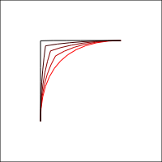
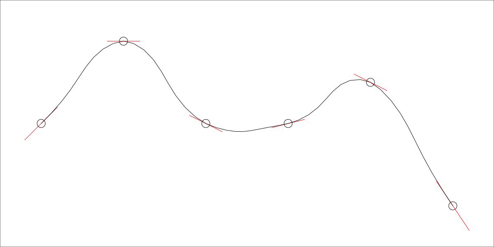
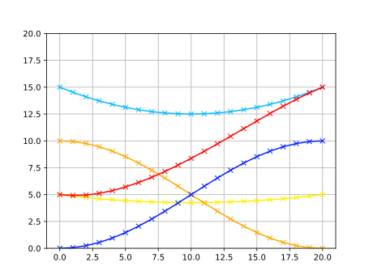

# simple bezier like interpolation

again, nothing fancy.

May need my vector module. if you find a nice and easy replacement for the vectors let me know.

this started out because my engineering classes mentioned bezier curves
and I want to just have them as a tool in my toolbox.

this is using the linear to smooth interpolation as well. Maybe to showcase something, idk.



but I also added some half done, not quite spline function,
that works just on neighbors, and still meets the continuity requirements
that splines are actually good for. so... "kind of the same thing"

but not actually splines. I think.



I did something else that's not quite the same...
It doesn't technically fit the bezier definition, but the result is pretty good.

It is continous in... what are the terms, the first and second derivatives?

They are smooth.

Inputs and outputs can be given in values or vectors, meaning you can specify
the tangent vector in a point and it will smooth it out like you can see with the
paths, here a picture to explain how it works.

there is the basic influence from the points and that gets scaled with an appropriately offset sine.

So

```
lightblue * darkblue + yellow * orange  => red
```


